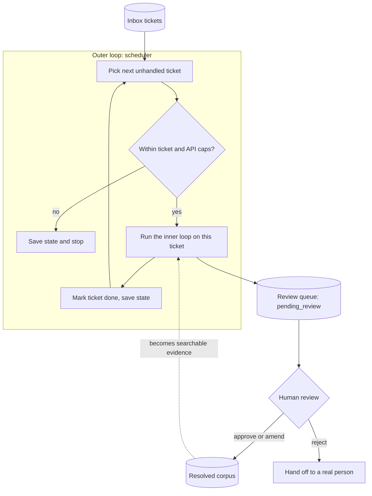
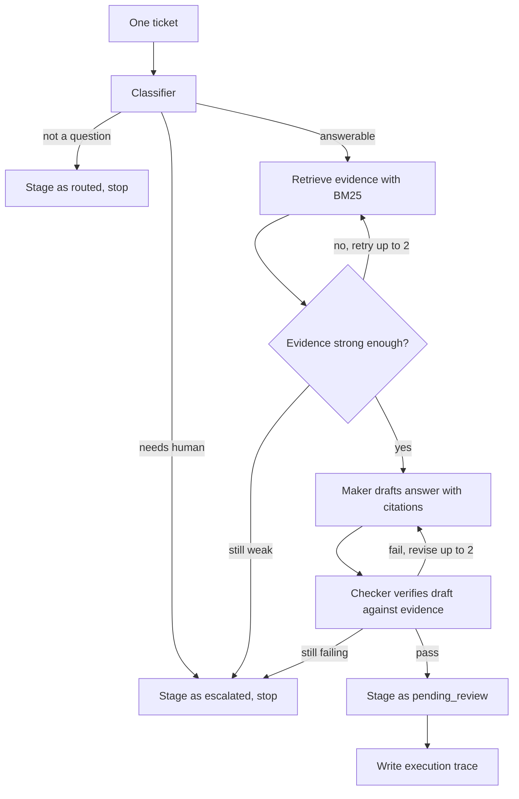

# SupportAgent

SupportAgent is a small autonomous agent that drafts answers to incoming support tickets. I built it in C# on top of DeepSeek. It reads simulated Jira tickets, searches a local Confluence style knowledge base and a pile of previously resolved tickets, writes a grounded answer with citations, checks its own work, and then puts the draft in a queue for a human to approve.

The one rule that shaped the whole design: the agent never talks to a customer. There is no "post" tool anywhere in the codebase, a gate blocks any action that is not on the allowlist, and the only thing the agent can actually write is a draft marked `pending_review`. A person decides what goes out.

This is a portfolio and learning project. It runs locally with synthetic data and is not meant to be hosted.

## The stack

* **C# / .NET 8** for everything. Console app for the CLI, ASP.NET Core minimal API for the small web UI.
* **DeepSeek** as the model provider (`deepseek-chat`).
* **The official OpenAI .NET SDK** (`OpenAI` 2.11.0) as the client. DeepSeek ships an OpenAI compatible API, so I point the SDK's base URL at `https://api.deepseek.com` and pass the DeepSeek key. No extra SDK, no custom HTTP plumbing. If I ever want to swap models, it is a base URL and a key.
* **BM25 keyword search** for retrieval, written in process. No vector database, no embeddings service. The corpus is tiny and BM25 is plenty for it, and it keeps the project dependency free on that front.
* **xUnit** for the tests.

The only third party package is the OpenAI SDK. The web bits come from the shared ASP.NET framework reference.

## Quick start

You need the .NET 8 SDK and a DeepSeek API key. The key is read from an environment variable and is never written to disk or logged.

```bash
export DEEPSEEK_API_KEY="your-key-here"
dotnet run -- ui
```

Then open `http://localhost:5050`. The agent starts working through the inbox on its own as soon as the server is up. Drafts that pass review land at `http://localhost:5050/review` for you to approve, amend, or reject.

If you prefer the terminal, there is a CLI for every step. The commands are listed near the bottom.

## How it works

There are two loops and one human.

The **outer loop** is the scheduler. Its only job is to decide what to work on. It scans the inbox, skips anything already handled, picks the next ticket, runs the inner loop on it, records the result, and moves on. It stops when the inbox is clear or when it hits a safety cap (a maximum number of tickets per run and a maximum number of API calls per run). State is saved to disk, so you can run it again and it will not redo finished work.

The **inner loop** is the agent itself. Given one ticket, it classifies the ticket, retrieves evidence, drafts an answer, verifies that answer, and stages the result. This is where the actual thinking happens.

The **human** sits at the end. Nothing reaches a customer without a person clicking approve. Approving or amending a draft appends the final answer back into the resolved corpus, which means the next ticket can retrieve it. The system gets a little better as people use it.



## The agent loop (inner loop) in detail

This is the part I care most about. Running a model in a loop is easy. Running a model in a loop that you can trust to stop, escalate, and refuse is the actual work.

For a single ticket the flow is:

1. **Classify.** The first model call sorts the ticket into one of three buckets: `answerable`, `not_a_question` (a bug report or a feature request, something that is not really a question), or `needs_human` (anything that touches a specific account, a specific lease, money, or anything risky). Only answerable tickets get a drafted answer. The rest are staged as `routed` or `escalated` and the loop ends early. Classification is a mandatory step, not an afterthought. The agent is not allowed to start writing before it has decided whether it should be writing at all.

2. **Retrieve.** For answerable tickets, BM25 pulls the most relevant passages from the docs and from past resolved tickets. There is a short confidence check here. If the evidence looks too thin, it retries retrieval a couple of times, and if it is still weak the ticket is escalated rather than answered on vibes.

3. **Make.** The maker is a model call that drafts an answer using only the retrieved passages, and it has to cite the sources it used. It also reports its own confidence.

4. **Check.** The checker is a separate model call. It does not get any tools. It only sees the draft and the same evidence, and its single job is to decide whether the draft is actually supported by that evidence. If the checker is not happy, it lists the problems and the maker gets to revise, up to two times. If it still cannot pass, the ticket is escalated.

5. **Stage and trace.** A passing draft is written to the review queue as `pending_review`, and a full trace of the run (classification, evidence, confidences, checker verdict) is saved so you can see exactly what happened.

Every tool call the agent makes goes through a gate first. The gate has an allowlist of four tools (`GetTicket`, `SearchDocs`, `SearchResolved`, `StageDraft`) and it blocks everything else. There is even a decoy `PostToCustomer` tool definition used in a demo to show the gate refusing it. The agent literally cannot post.



## Why maker checker matters

This is the heart of the project, so it is worth being clear about.

If you give a model a goal and let it call tools in a loop, the obvious failure mode is that it keeps going. It drafts something, decides it is good, and acts. The model that wrote the answer is the same model grading the answer, and a model grading its own output is not a control, it is a rubber stamp. You end up with a loop that always thinks it succeeded.

Maker checker splits those two jobs into two separate calls with different instructions. The maker writes. The checker, with no tools and no ability to act, only judges whether the writing is grounded in the evidence that was actually retrieved. Because the checker has a narrow job and cannot "fix" things itself, it is much more willing to say no. When it says no, the maker revises, and there is a hard cap on revisions so the disagreement cannot spin forever. If they cannot agree, the ticket goes to a human instead of going out wrong.

That is the difference between an autonomous loop and an infinite loop. Without an independent check and a real stopping condition, you do not have an agent that knows when to quit. You just have a while loop with a language model in it. The maker checker pattern, the evidence threshold, the revision cap, the classification gate, and the human at the end are all there to answer one question: when is the agent allowed to stop, and when must it back off. Take those out and the rest of the system is just plausible text generation.

## Project layout

```
SupportAgent/
├── Program.cs                 CLI entry point and command routing
├── ListData.cs                "list-data" command, dumps the synthetic corpus
├── SupportAgent.csproj        net8.0, OpenAI SDK, ASP.NET framework reference
│
├── Llm/                       Everything that talks to the model
│   ├── ILlmClient.cs          The model abstraction
│   ├── DeepSeekClient.cs      OpenAI SDK ChatClient pointed at DeepSeek
│   ├── DeepSeekSettings.cs    Reads DEEPSEEK_API_KEY, base URL, model name
│   ├── ApiCallTracker.cs      Counts API calls and enforces the per run cap
│   └── LlmTurnResult.cs       Result of one tool calling turn
│
├── Tools/                     What the agent is allowed to touch
│   ├── Models.cs              Ticket, SearchHit, StagedDraft records
│   ├── SupportTools.cs        The four tools plus all file reads and writes
│   ├── IRetrievalIndex.cs     Retrieval behind an interface
│   ├── Bm25Index.cs           BM25 keyword search
│   └── TicketId.cs            Ticket id validation
│
├── Agent/                     The brains
│   ├── AgentLoop.cs           Per ticket orchestrator, writes the trace
│   ├── IAgentRunner.cs        Interface over the loop, used in tests
│   ├── TicketClassifier.cs    The three bucket classifier
│   ├── ITicketClassifier.cs   Classifier interface
│   ├── TicketClassification.cs  The bucket result type
│   ├── ExpectedInboxBuckets.cs  Reference answers for the demo tickets
│   ├── EvidenceRetriever.cs   BM25 retrieval plus the evidence confidence loop
│   ├── IEvidenceRetriever.cs  Retriever interface
│   ├── EvidenceSet.cs         The retrieved passages
│   ├── DraftMaker.cs          The maker and the checker (both live here)
│   ├── MakerCheckerModels.cs  DraftResult, CheckerVerdict, evidence parsing
│   ├── MakerCheckerPipeline.cs  Retrieve, make, check, revise, stage or escalate
│   ├── MakerCheckerOptions.cs   Thresholds and caps (0.65 evidence, 2 revisions)
│   ├── ToolGate.cs            The allowlist that blocks non approved tools
│   ├── ToolDispatcher.cs      Routes tool calls through the gate
│   ├── AgentToolDefinitions.cs  Tool schemas, including the PostToCustomer decoy
│   ├── InboxRunner.cs         "inbox" command, forces every ticket
│   ├── InboxScheduler.cs      The outer loop: skip, cap, persist
│   ├── SchedulerOptions.cs    Outer loop caps and the run result type
│   ├── LoopState.cs           Persisted record of completed tickets
│   ├── ReviewService.cs       Approve, amend, reject
│   ├── ReviewQueueView.cs     Prints the queue in the terminal
│   ├── TicketTrace.cs         The shape of an execution trace
│   ├── TraceWriter.cs         Saves traces
│   └── TraceReader.cs         Loads traces (used by the UI)
│
├── Ui/                        The local web UI
│   ├── ReviewUiHost.cs        Minimal API host, endpoints, auto run on launch
│   ├── MonitorPage.cs         The live monitor page
│   ├── ReviewPage.cs          The review queue page
│   ├── UiTheme.cs             Shared CSS so both pages match
│   ├── AgentDashboard.cs      Builds the status snapshot the UI polls
│   ├── AgentRunState.cs       In memory state of the auto run batch
│   ├── ReviewQueueBuilder.cs  Builds the pending review items for the page
│   └── DraftEnricher.cs       Fills missing draft fields from traces
│
├── data/                      All synthetic, all local
│   ├── inbox/tickets.json     The incoming tickets (T-1001 to T-1010)
│   ├── docs/                  Confluence style knowledge base (CONF-*)
│   ├── resolved/              Past resolved tickets (RES-*), grows on approval
│   ├── review_queue/          Staged drafts awaiting review (gitignored)
│   ├── traces/                Execution traces (gitignored)
│   ├── LOOP_STATE.json        Scheduler state (gitignored)
│   └── amendments.log         Audit trail of human edits (gitignored)
│
└── SupportAgent.Tests/        xUnit tests
```

The data files for docs and resolved tickets describe a fictional asset finance API called CapStream. None of it is real, and there is no real customer information anywhere in the repo.

## CLI reference

```bash
# One ticket, end to end
dotnet run -- agent T-1001

# Show the gate refusing a forbidden post
dotnet run -- agent T-1001 --demo-forbidden-post   # look for GATE DENIED

# Every ticket in the inbox, no skipping
dotnet run -- inbox

# The outer loop: skip handled tickets, respect caps, save state
dotnet run -- schedule
dotnet run -- schedule --max-tickets 5 --max-api-calls 40

# Review from the terminal
dotnet run -- review-queue
dotnet run -- review approve T-1001
dotnet run -- review amend T-1001 "edited answer text"
dotnet run -- review reject T-1001

# The web UI (agent starts automatically)
dotnet run -- ui

# See the synthetic corpus
dotnet run -- list-data
```

## Tests

```bash
dotnet test SupportAgent.Tests/SupportAgent.Tests.csproj
```

The suite covers the classifier routing, the maker checker pipeline, the tool gate, retrieval, the review flow, the scheduler caps and skipping, and the UI queue building.
